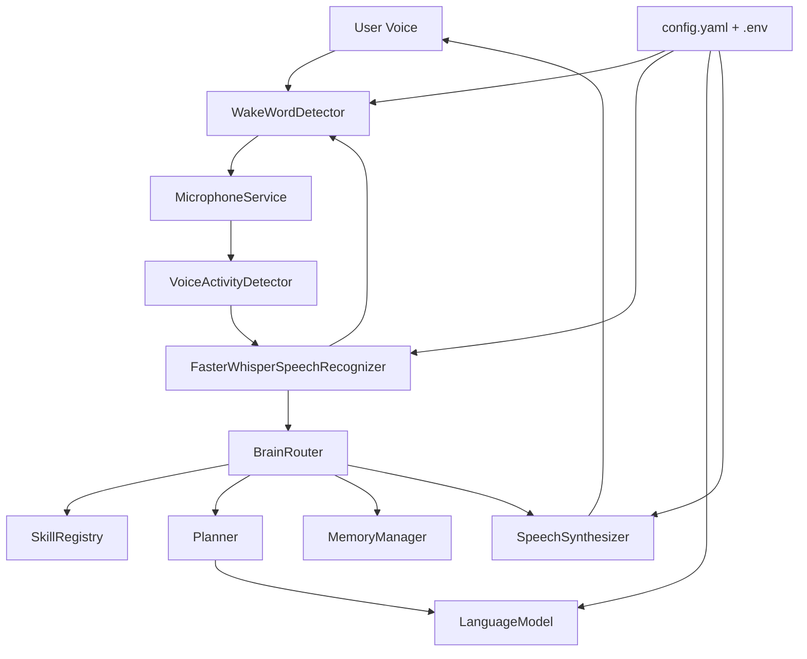

# JARVIS

JARVIS is a modular AI operating system foundation written in Python 3.12+. Version 0.1 focuses on the core voice conversation loop, provider interfaces, configuration, logging, memory boundaries, and a plugin-ready skill architecture.

## Architecture



## Version 0.1 Features

- Wake word detection for `Jarvis`
- `sounddevice` microphone capture at 16 kHz mono float32
- WebRTC VAD that starts on speech and stops after silence
- Faster-Whisper speech recognition with tiny, base, and small model support
- Swappable language model interface with an echo provider and OpenAI-compatible adapter
- Text-to-speech provider interface with best-effort female voice selection through system voices
- Conversation loop: wake word, command recognition, brain response, speech synthesis
- Conversation memory abstraction with future vector and SQLite boundaries
- Skill plugin registry for future PC control, ESP32, MQTT, email, calendar, vision, browser automation, engineering tools, file search, weather, GitHub, and home automation
- Structured logging for startup, speech events, AI requests, errors, and timing

## Installation

```bash
cd JARVIS
python -m venv .venv
.venv\Scripts\activate
pip install -r requirements.txt
copy .env.example .env
```

On Linux or macOS, activate the virtual environment with `source .venv/bin/activate`.

Microphone input uses `sounddevice`, WebRTC VAD, and Faster-Whisper. The Whisper model is loaded once during startup before JARVIS begins listening.

## Running

From the directory that contains `JARVIS/`:

```bash
python -m JARVIS.main
```

Say `Jarvis`, then speak your command. You can also say a phrase such as `Jarvis what can you do` and JARVIS will use the words after the wake word as the command.

## Configuration

Configuration comes from `config/config.yaml`, then environment variables from `.env` override selected values. API keys must live in `.env` or the shell environment, never in source code.

Useful development overrides:

```env
JARVIS_VOICE_BACKEND=faster_whisper
JARVIS_WHISPER_MODEL=tiny
JARVIS_WHISPER_COMPUTE_TYPE=int8
JARVIS_LLM_PROVIDER=echo
```

To use an OpenAI-compatible cloud model:

```env
JARVIS_LLM_PROVIDER=openai
JARVIS_LLM_MODEL=gpt-4.1-mini
OPENAI_API_KEY=replace-me
```

## Folder Guide

- `api/`: future HTTP, WebSocket, and app APIs
- `automation/`: scheduled and workflow automation modules
- `brain/`: router, planner, memory manager, and personality system
- `config/`: typed settings loader and YAML configuration
- `hardware/`: future hardware and sensor integrations
- `logs/`: runtime log files
- `memory/`: future persistent memory implementations
- `models/`: interfaces, shared types, exceptions, and LLM providers
- `pc/`: future desktop control
- `skills/`: plugin registry and built-in skills
- `ui/`: future desktop, mobile, or web UI
- `vision/`: future OpenCV, YOLO, and camera modules
- `voice/`: wake word, speech-to-text, and text-to-speech providers
  - `microphone.py`: 16 kHz mono float32 microphone capture through `sounddevice`
  - `vad.py`: WebRTC voice activity detection
  - `whisper_stt.py`: Faster-Whisper transcription provider

## Developer Guide

All major subsystems depend on interfaces from `models/interfaces.py`. To replace a provider, implement the interface and update the corresponding factory.

To add a skill without modifying the core loop:

```python
from JARVIS.models.interfaces import Skill
from JARVIS.models.types import SkillResult


class WeatherSkill(Skill):
    @property
    def name(self) -> str:
        return "weather"

    @property
    def description(self) -> str:
        return "Answers weather questions."

    def can_handle(self, command: str) -> bool:
        return "weather" in command.lower()

    def handle(self, command: str) -> SkillResult:
        return SkillResult(content="Weather integration is not configured yet.")


def register(registry):
    registry.register(WeatherSkill())
```

Then add the plugin file or package path to `skills.plugin_paths` in `config/config.yaml`, or publish it with the `jarvis.skills` Python entry point group.

## Testing

From the directory that contains `JARVIS/`:

```bash
pytest
```

## Roadmap

- v0.2: persistent SQLite conversation memory, richer provider selection, better wake word engines
- v0.3: PC control skills, file search, browser automation, and GitHub integration
- v0.4: vision module with OpenCV and YOLO-compatible detectors
- v0.5: MQTT, ESP32, and home automation skills
- v0.6: vector memory, local LLM support, and multi-agent planning
- v1.0: desktop and mobile control surfaces, permissions, audit logs, and production packaging

## Contribution Guide

- Keep modules small and focused.
- Add type hints and docstrings for public classes and functions.
- Do not hardcode secrets.
- Prefer dependency injection over hidden imports in business logic.
- Add focused tests for new interfaces, providers, and skills.
- Run `black .`, `ruff check .`, and `pytest` before submitting changes.
